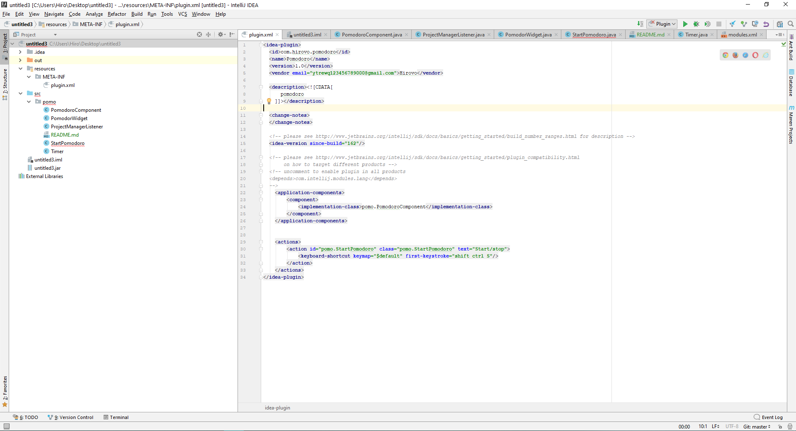

# Таймер помодоро для intellij idea
Данный компонент добавляет помодоро таймер в IDEA 

Таймер можно запустить или приостанвить нажатием комбинации клавиш ctrl+shift+s либо нажатием на виджет

Виджет ведет контроль рабочего времени, промежутков перерыва и длинных перерываов, так же подсчитывает общее количество прошедших промежутков с момента старта

Промежутки делятся на 25мин работы 5мин перерыва, каждый четвертый перерыв 15мин 